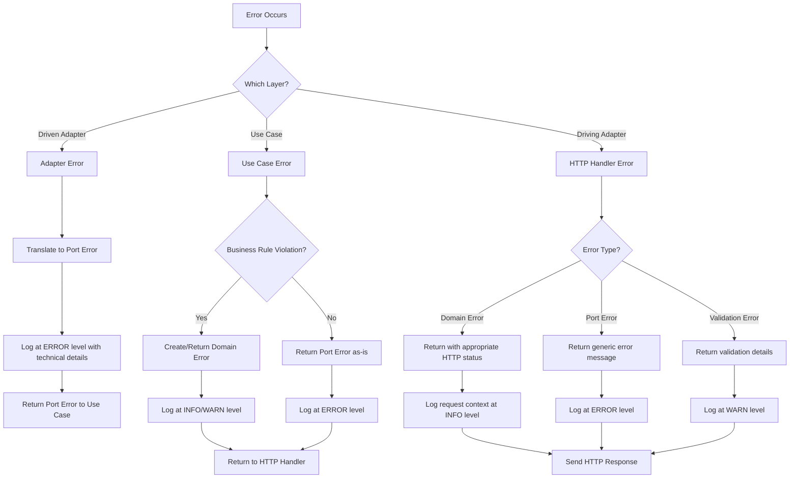

# Error Handling Guide

## Overview

This document outlines the error handling strategy for the Proletariat Budget API, which follows a hexagonal architecture pattern. Our error handling approach ensures that errors are properly categorized, transformed, and propagated through the different layers of the application while maintaining clear separation of concerns.

## Error Categories

### 1. Domain Errors
Domain errors represent business rule violations and are defined in the core domain layer. These errors are meaningful to the business and should be communicated to users in a clear, actionable way.

**Examples:**
- `ErrMemberHasActiveAccounts`: When trying to deactivate a member who still has active accounts
- `ErrMemberAlreadyActive`: When trying to activate an already active member
- `ErrInsufficientFunds`: When trying to transfer more money than available

**Characteristics:**
- Defined in `internal/core/domain/`
- Business-meaningful error messages
- Should be returned to users with appropriate HTTP status codes
- Logged at INFO or WARN level (not ERROR, as they're expected business scenarios)

### 2. Port Errors
Port errors are infrastructure-related errors that occur when interacting with external systems (databases, APIs, etc.). These are defined in the port interfaces and represent technical failures.

**Examples:**
- `ErrDatabaseConnection`: Database connectivity issues
- `ErrRecordNotFound`: When a requested resource doesn't exist
- `ErrDuplicateKey`: Database constraint violations

**Characteristics:**
- Defined in `internal/core/port/infra_errors.go`
- Technical in nature
- Should be logged at ERROR level
- May be transformed into domain errors or returned as generic error messages to users

### 3. Adapter Errors
Adapter errors are low-level technical errors that occur in the adapter implementations. These should always be translated into port errors before leaving the adapter layer.

**Examples:**
- SQL syntax errors
- Network timeouts
- File system errors

**Characteristics:**
- Specific to the adapter implementation
- Should never propagate beyond the adapter layer
- Always translated to port errors
- Logged at ERROR level with full technical details

## Error Handling Decision Tree


## Implementation Guidelines

### Driven Adapter Layer (MySQL, External APIs)

#### Rules:

1. Always translate adapter-specific errors into port errors
2. Log technical details at ERROR level
3. Never let implementation-specific errors escape the adapter

#### Example:

```go
func (r *AccountRepoImpl) GetByID(ctx context.Context, id string) (*domain.Account, error) {
    var account domain.Account
    err := r.db.QueryRowContext(ctx, "SELECT * FROM accounts WHERE id = ?", id).Scan(...)
    
    if err != nil {
        if errors.Is(err, sql.ErrNoRows) {
            // Translate to port error
            return nil, port.ErrRecordNotFound
        }
        
        // Log technical details
        log.Error().Err(err).Str("account_id", id).Msg("Failed to query account")
        
        // Return generic port error
        return nil, port.ErrDatabaseOperation
    }
    
    return &account, nil
}
```

### Use Case Layer

#### Rules:

1. Validate business rules and return domain errors for violations
2. Pass through port errors for technical failures
3. Log domain errors at INFO/WARN level, port errors at ERROR level

#### Example:

```go
func (uc *HouseholdMemberUseCase) DeactivateMember(ctx context.Context, id string) error {
    // Check if member has active accounts (business rule)
    hasActiveAccounts, err := uc.accountRepo.HasActiveAccountsForMember(ctx, id)
    if err != nil {
        // Port error - log and return as-is
        log.Error().Err(err).Str("member_id", id).Msg("Failed to check active accounts")
        return err
    }
    
    if hasActiveAccounts {
        // Business rule violation - domain error
        log.Info().Str("member_id", id).Msg("Cannot deactivate member with active accounts")
        return domain.ErrMemberHasActiveAccounts
    }
    
    // Proceed with deactivation
    err = uc.householdMembersRepo.Deactivate(ctx, id)
    if err != nil {
        // Port error - log and return as-is
        log.Error().Err(err).Str("member_id", id).Msg("Failed to deactivate member")
        return err
    }
    
    return nil
}
```

### Driving Adapter Layer (HTTP Handlers)

#### Rules:

1. Map domain errors to appropriate HTTP status codes with user-friendly messages
2. Map port errors to generic error responses (don't expose technical details)
3. Handle validation errors with detailed feedback
4. Log all errors with request context

#### Example:
```go
func (h *HouseholdMemberHandler) DeactivateMember(w http.ResponseWriter, r *http.Request) {
    memberID := chi.URLParam(r, "id")
    
    err := h.useCase.DeactivateMember(r.Context(), memberID)
    if err != nil {
        switch {
        case errors.Is(err, domain.ErrMemberHasActiveAccounts):
            // Domain error - user-friendly message with appropriate status
            log.Info().Str("member_id", memberID).Msg("Deactivation blocked: member has active accounts")
            http.Error(w, "Cannot deactivate member with active accounts. Please close or transfer all accounts first.", http.StatusConflict)
            
        case errors.Is(err, port.ErrRecordNotFound):
            // Port error - map to appropriate HTTP status
            log.Warn().Str("member_id", memberID).Msg("Member not found")
            http.Error(w, "Member not found", http.StatusNotFound)
            
        default:
            // Unknown/technical error - generic message
            log.Error().Err(err).Str("member_id", memberID).Msg("Failed to deactivate member")
            http.Error(w, "Internal server error", http.StatusInternalServerError)
        }
        return
    }
    
    w.WriteHeader(http.StatusNoContent)
}
```

### HTTP Status Code Mapping
| Error Type                            | HTTP Status                 | When to Use |
|---------------------------------------|-----------------------------|-------------|
| Validation errors, malformed requests | `400 Bad Request`           | Invalid input data, missing required fields |
| Authentication errors                 | `401 Unauthorized`          | Missing or invalid authentication tokens |
| Authorization errors                  | `403 Forbidden`             | User doesn't have permission for the action |
| `port.ErrRecordNotFound`              | `404 Not Found`             | Requested resource doesn't exist |
| Business rule violations              | `409 Conflict`              | Domain errors like `ErrMemberHasActiveAccounts` |
| Business logic errors                 | `422 Unprocessable Entity`  | Valid input but business rules prevent processing |
| Technical/infrastructure errors       | `500 Internal Server Error` | Database errors, external service failures |
| Service dependency failures           | `503 Service Unavailable`   | External services down, database unreachable |

### Logging Strategy
#### Log Levels
- ERROR: Technical failures, infrastructure issues, unexpected errors
- WARN: Expected but noteworthy events (e.g., not found, validation failures)
- INFO: Business events, successful operations, domain errors
- DEBUG: Detailed execution flow (development only)
#### Log Context
Always include relevant context in logs:
- Request ID (for tracing)
- User ID (when available)
- Resource IDs (account_id, member_id, etc.)
- Operation being performed
- Error details (for technical errors)
##### Example Log Entries

```go
// Technical error
log.Error().
    Err(err).
    Str("request_id", requestID).
    Str("user_id", userID).
    Str("account_id", accountID).
    Msg("Database connection failed during account retrieval")

// Business rule violation
log.Info().
    Str("request_id", requestID).
    Str("user_id", userID).
    Str("member_id", memberID).
    Msg("Member deactivation blocked: has active accounts")

// Successful operation
log.Info().
    Str("request_id", requestID).
    Str("user_id", userID).
    Str("account_id", accountID).
    Decimal("amount", amount).
    Msg("Account transfer completed successfully")
```

### Best Practices
1. Fail Fast: Validate inputs and business rules as early as possible
2. Error Wrapping: Use fmt.Errorf("context: %w", err) to add context while preserving error chains
3. Consistent Messages: Use consistent error messages for the same error types
4. Security: Never expose sensitive information in error messages returned to users
5. Monitoring: Ensure all ERROR-level logs are monitored and alerted on
6. Testing: Write tests for error scenarios, not just happy paths
7. Documentation: Keep error codes and messages documented in the OpenAPI specification