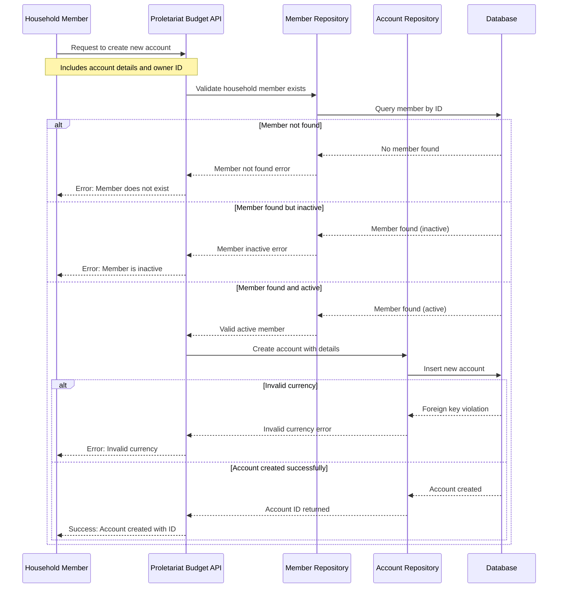

# Create Account Use Case

## Overview

This use case describes the process of creating a new financial account within the Proletariat Budget system. An account represents a financial container (such as a bank account, credit card, or cash wallet) that belongs to a household member and can hold transactions.

## Actors

- **Primary Actor**: Household Member (the person creating the account)
- **System**: Proletariat Budget API

## Preconditions

- The household member must exist in the system
- The household member must be active (not deactivated)
- A valid currency must be specified for the account

## Main Success Scenario

1. User provides account details including owner information and currency
2. System validates that the specified household member exists
3. System verifies that the household member is currently active
4. System validates that the specified currency is supported
5. System creates the new account with the provided information
6. System returns the unique identifier of the newly created account

## Alternative Flows

### A1: Household Member Not Found
- **Trigger**: The specified household member ID does not exist in the system
- **Action**: System returns an error indicating the member was not found
- **Result**: Account creation fails

### A2: Household Member Inactive
- **Trigger**: The specified household member exists but is currently deactivated
- **Action**: System returns an error indicating the member is inactive
- **Result**: Account creation fails

### A3: Invalid Currency
- **Trigger**: The specified currency code is not supported by the system
- **Action**: System returns an error indicating invalid currency
- **Result**: Account creation fails

## Postconditions

### Success
- A new account is created and stored in the system
- The account is linked to the specified household member
- The account is set to active status by default
- A unique account identifier is generated and returned

### Failure
- No account is created
- System state remains unchanged
- Appropriate error message is returned to the user

## Business Rules

1. **Member Ownership**: Every account must be owned by an existing household member
2. **Active Members Only**: Only active household members can own new accounts
3. **Currency Validation**: The account currency must be from the system's supported currency list
4. **Unique Identification**: Each account receives a unique system-generated identifier

## Data Requirements

### Input Data
- Account name and description
- Account type (bank, credit card, cash, etc.)
- Initial balance
- Currency code
- Owner (household member) identifier
- Optional: Institution name, account number

### Output Data
- Unique account identifier (on success)
- Error message and code (on failure)

## Error Handling

| Error Condition | Error Code | User Message |
|----------------|------------|--------------|
| Member not found | `MEMBER_NOT_FOUND` | "The specified household member does not exist" |
| Member inactive | `MEMBER_INACTIVE` | "Cannot create account for inactive household member" |
| Invalid currency | `INVALID_CURRENCY` | "The specified currency is not supported" |
| System error | `INTERNAL_ERROR` | "An unexpected error occurred while creating the account" |

