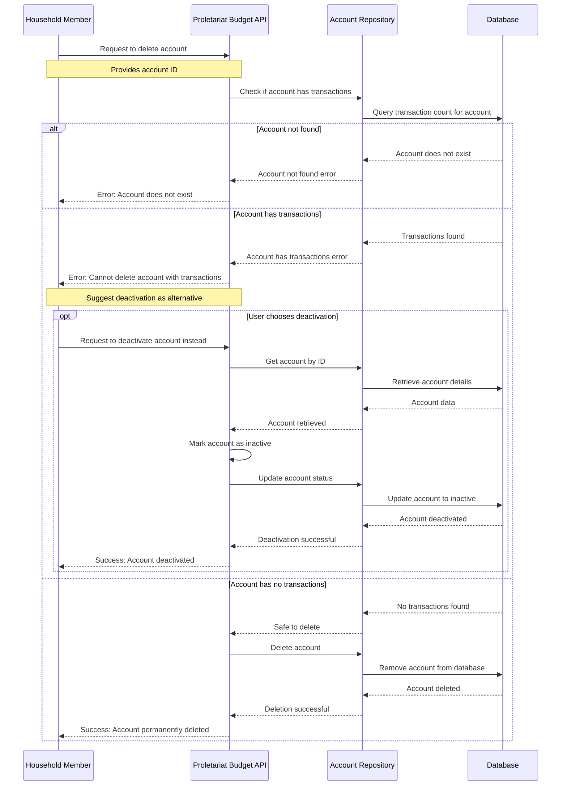

# Delete Account Use Case

## Overview

This use case describes the process of permanently removing a financial account from the Proletariat Budget system. Account deletion is a destructive operation that completely removes the account and all its associated data. If an account cannot be deleted due to existing transactions, users have the alternative option to deactivate the account instead.

## Actors

- **Primary Actor**: Household Member (the person deleting the account)
- **System**: Proletariat Budget API

## Preconditions

- The account must exist in the system
- User must have appropriate permissions to delete the account

## Main Success Scenario

1. User requests to delete a specific account by providing the account ID
2. System checks if the account has any associated transactions
3. System verifies that the account has no transaction history
4. System permanently removes the account from the database
5. System confirms successful deletion

## Alternative Flows

### A1: Account Not Found
- **Trigger**: The specified account ID does not exist in the system
- **Action**: System returns an error indicating the account was not found
- **Result**: Deletion fails

### A2: Account Has Transactions (Cannot Delete)
- **Trigger**: The account has existing transaction history
- **Action**: System returns an error indicating the account cannot be deleted
- **Alternative**: User can choose to deactivate the account instead
- **Result**: Deletion fails, but deactivation option is available

### A3: Account Deactivation (Alternative Path)
- **Trigger**: User chooses to deactivate instead of delete (when deletion is not possible)
- **Process**: 
  1. System retrieves the account information
  2. System marks the account as inactive
  3. System updates the account status in the database
- **Result**: Account becomes inactive but remains in the system with transaction history preserved

## Postconditions

### Success (Deletion)
- The account is permanently removed from the system
- All account data is deleted (except transaction history is preserved elsewhere)
- The account ID becomes invalid for future operations

### Success (Deactivation Alternative)
- The account remains in the system but is marked as inactive
- Transaction history is preserved
- The account cannot be used for new transactions
- The account can be reactivated later if needed

### Failure
- Account remains unchanged in the system
- Appropriate error message is returned to the user

## Business Rules

1. **Transaction Protection**: Accounts with existing transactions cannot be deleted to maintain financial audit trails
2. **Permanent Action**: Account deletion is irreversible and permanently removes account data
3. **Alternative Solution**: When deletion is not possible, deactivation provides a safe alternative
4. **Data Integrity**: Transaction history must be preserved even when accounts are deleted
5. **Audit Trail**: The system maintains records of account deletion for compliance purposes

## Data Requirements

### Input Data
- Account identifier (ID)

### Output Data
- Success confirmation (on successful deletion/deactivation)
- Error message and code (on failure)

## Error Handling

| Error Condition | Error Code | User Message | Alternative Action |
|----------------|------------|--------------|-------------------|
| Account not found | `ACCOUNT_NOT_FOUND` | "The specified account does not exist" | None |
| Account has transactions | `ACCOUNT_HAS_TRANSACTIONS` | "Cannot delete account with existing transactions" | Offer deactivation |
| System error | `INTERNAL_ERROR` | "An unexpected error occurred while deleting the account" | Retry operation |

## Decision Matrix

| Account Status | Has Transactions | Action Available | Result |
|---------------|------------------|------------------|---------|
| Active | No | Delete | Account permanently removed |
| Active | Yes | Deactivate only | Account marked inactive |
| Inactive | No | Delete | Account permanently removed |
| Inactive | Yes | Already deactivated | No action needed |

## Related Use Cases

- **Deactivate Account**: Alternative when deletion is not possible
- **Reactivate Account**: Reverse deactivation if needed
- **View Account Transactions**: Check transaction history before deletion

