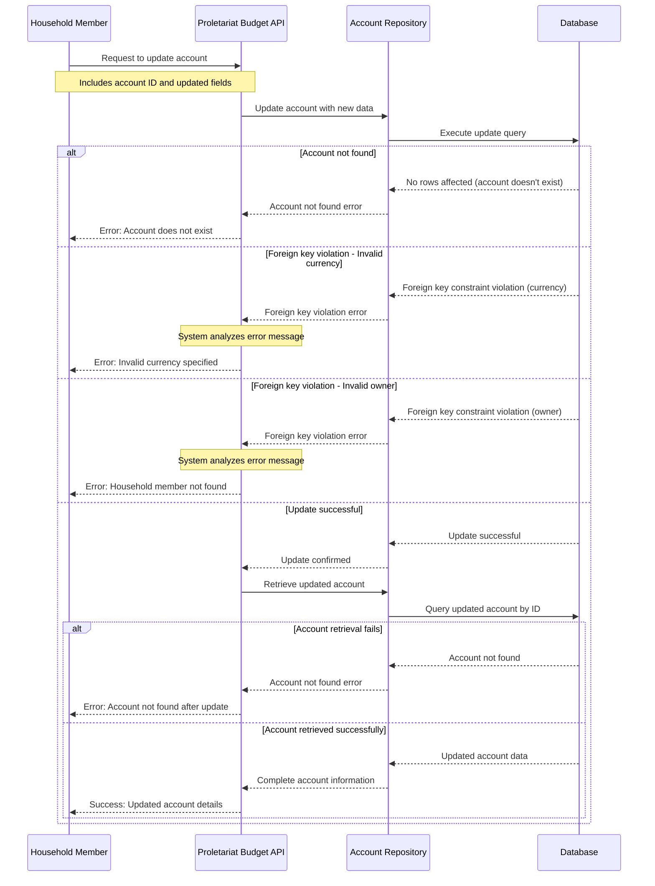

# Update Account Use Case

## Overview

This use case describes the process of modifying an existing financial account within the Proletariat Budget system. Users can update various account properties such as account information, owner, currency, and other details while maintaining data integrity and business rules.

## Actors

- **Primary Actor**: Household Member (the person updating the account)
- **System**: Proletariat Budget API

## Preconditions

- The account must exist in the system
- User must have appropriate permissions to update the account
- If changing the owner, the new owner must be an existing household member
- If changing the currency, it must be a valid supported currency

## Main Success Scenario

1. User provides updated account information including the account ID
2. System validates that the account exists
3. System validates any foreign key references (owner, currency)
4. System updates the account with the new information
5. System retrieves and returns the updated account details
6. User receives confirmation with the updated account information

## Alternative Flows

### A1: Account Not Found
- **Trigger**: The specified account ID does not exist in the system
- **Action**: System returns an error indicating the account was not found
- **Result**: Update operation fails

### A2: Invalid Currency
- **Trigger**: The new currency code is not supported by the system
- **Action**: System returns an error indicating invalid currency
- **Result**: Update operation fails

### A3: Invalid Owner (Member Not Found)
- **Trigger**: The new owner ID does not correspond to an existing household member
- **Action**: System returns an error indicating the member was not found
- **Result**: Update operation fails

## Postconditions

### Success
- The account is updated with new information
- All foreign key relationships are maintained
- Updated account data is returned to the user
- System maintains data consistency

### Failure
- Account remains unchanged
- System state is preserved
- Appropriate error message is returned to the user

## Business Rules

1. **Account Existence**: The account being updated must exist in the system
2. **Owner Validation**: If changing the account owner, the new owner must be a valid household member
3. **Currency Validation**: The account currency must be from the system's supported currency list
4. **Data Integrity**: All foreign key relationships must be maintained during updates
5. **Atomic Operation**: Either all changes are applied successfully, or none are applied

## Data Requirements

### Input Data
- Account identifier (ID) - required
- Updated account information (optional fields):
  - Account name and description
  - Account type
  - Currency code
  - Owner (household member) identifier
  - Institution name
  - Account number
  - Other account metadata

### Output Data
- Complete updated account information (on success)
- Error message and code (on failure)

## Error Handling

| Error Condition | Error Code | User Message |
|----------------|------------|--------------|
| Account not found | `ACCOUNT_NOT_FOUND` | "The specified account does not exist" |
| Member not found | `MEMBER_NOT_FOUND` | "The specified household member does not exist" |
| Invalid currency | `INVALID_CURRENCY` | "The specified currency is not supported" |
| Data format error | `INVALID_DATA_FORMAT` | "The provided data format is invalid" |
| System error | `INTERNAL_ERROR` | "An unexpected error occurred while updating the account" |

## Validation Rules

### Required Fields
- Account ID (must exist in system)

### Optional Fields (when provided)
- **Owner ID**: Must reference existing household member
- **Currency**: Must be valid ISO currency code supported by system
- **Account Type**: Must be from predefined list (bank, credit, cash, etc.)
- **Account Number**: Format validation based on account type
- **Institution**: Text field with reasonable length limits

## Update Process Flow

1. **Input Validation**: Verify required fields and data formats
2. **Existence Check**: Confirm account exists in system
3. **Reference Validation**: Validate foreign key references (owner, currency)
4. **Data Update**: Apply changes to account record
5. **Retrieval**: Fetch updated account with all related data
6. **Response**: Return complete updated account information

## Related Use Cases

- **Create Account**: Initial account creation
- **Get Account**: Retrieve account information
- **Delete Account**: Remove account from system
- **Deactivate Account**: Temporarily disable account

