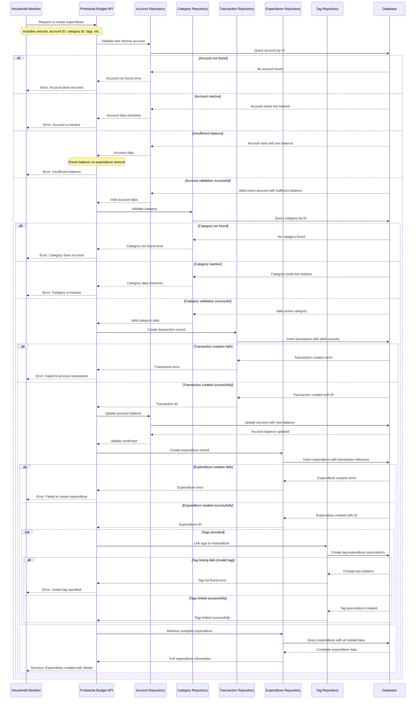

# Create Expenditure Use Case

## Overview

This use case describes the process of recording a new expenditure (expense) within the Proletariat Budget system. An expenditure represents money spent from an account for a specific purpose, categorized and optionally tagged for better financial tracking. Once created, expenditures are immutable and can only be reversed through a rollback operation.

## Actors

- **Primary Actor**: Household Member (the person recording the expenditure)
- **System**: Proletariat Budget API

## Preconditions

- The account from which money is spent must exist and be active
- The account must have sufficient balance to cover the expenditure amount
- The expenditure category must exist and be active
- Any tags to be associated must exist in the system
- User must have appropriate permissions to create expenditures

## Main Success Scenario

1. User provides expenditure details including amount, account, category, and optional tags
2. System validates that the specified account exists and is active
3. System validates that the specified category exists and is active
4. System checks that the account has sufficient balance for the expenditure
5. System processes the financial transaction, debiting the account balance
6. System creates the expenditure record with all provided details
7. System links any specified tags to the expenditure
8. System returns the complete expenditure information including transaction details
9. User receives confirmation with the created expenditure details

## Alternative Flows

### A1: Account Not Found
- **Trigger**: The specified account ID does not exist in the system
- **Action**: System returns an error indicating the account was not found
- **Result**: Expenditure creation fails

### A2: Account Inactive
- **Trigger**: The specified account exists but is deactivated
- **Action**: System returns an error indicating the account is inactive
- **Result**: Expenditure creation fails

### A3: Insufficient Balance
- **Trigger**: The account balance is less than the expenditure amount
- **Action**: System returns an error indicating insufficient funds
- **Result**: Expenditure creation fails

### A4: Category Not Found
- **Trigger**: The specified category ID does not exist in the system
- **Action**: System returns an error indicating the category was not found
- **Result**: Expenditure creation fails

### A5: Category Inactive
- **Trigger**: The specified category exists but is deactivated
- **Action**: System returns an error indicating the category is inactive
- **Result**: Expenditure creation fails

### A6: Tag Not Found
- **Trigger**: One or more specified tag IDs do not exist in the system
- **Action**: System returns an error indicating invalid tags
- **Result**: Expenditure creation fails

## Postconditions

### Success
- A new expenditure record is created in the system
- The account balance is reduced by the expenditure amount
- A corresponding transaction record is created and linked to the expenditure
- All specified tags are linked to the expenditure
- The expenditure is available for reporting and analysis
- System maintains data consistency across all related entities

### Failure
- No expenditure record is created
- Account balance remains unchanged
- No transaction record is created
- System state is preserved
- Appropriate error message is returned to the user

## Business Rules

1. **Account Validation**: The account must exist and be active to record expenditures
2. **Balance Requirement**: The account must have sufficient balance to cover the expenditure
3. **Category Validation**: The expenditure category must exist and be active
4. **Tag Validation**: All specified tags must exist in the system
5. **Immutability**: Once created, expenditures cannot be modified, only rolled back
6. **Transaction Integrity**: Each expenditure creates exactly one debit transaction
7. **Atomic Operation**: Either all components (expenditure, transaction, tag links) are created successfully, or none are created

## Data Requirements

### Input Data
- **Amount**: The expenditure amount (must be positive)
- **Account ID**: Identifier of the account from which money is spent
- **Category ID**: Identifier of the expenditure category
- **Description**: Optional description of the expenditure
- **Transaction Date**: When the expenditure occurred
- **Tags**: Optional list of tag identifiers for categorization
- **Declared**: Whether the expenditure is officially declared
- **Planned**: Whether the expenditure was planned in advance

### Output Data
- Complete expenditure information including:
  - Expenditure ID and details
  - Associated transaction information
  - Account balance after the expenditure
  - Linked category and tags
  - Creation timestamp

## Error Handling

| Error Condition | Error Code | User Message |
|----------------|------------|--------------|
| Account not found | `ACCOUNT_NOT_FOUND` | "The specified account does not exist" |
| Account inactive | `ACCOUNT_INACTIVE` | "Cannot create expenditure on inactive account" |
| Insufficient balance | `INSUFFICIENT_BALANCE` | "Account balance is insufficient for this expenditure" |
| Category not found | `CATEGORY_NOT_FOUND` | "The specified category does not exist" |
| Category inactive | `CATEGORY_INACTIVE` | "Cannot use inactive category for expenditure" |
| Tag not found | `TAG_NOT_FOUND` | "One or more specified tags do not exist" |
| Data format error | `INVALID_DATA_FORMAT` | "The provided data format is invalid" |
| System error | `INTERNAL_ERROR` | "An unexpected error occurred while creating the expenditure" |

## Validation Rules

### Required Fields
- Amount (must be positive number)
- Account ID (must reference existing active account)
- Category ID (must reference existing active category)
- Transaction date

### Optional Fields
- Description (text with reasonable length limits)
- Tags (must reference existing tag IDs)
- Declared flag (defaults to false)
- Planned flag (defaults to false)

## Creation Process Flow

1. **Input Validation**: Verify required fields and data formats
2. **Account Validation**: Confirm account exists, is active, and has sufficient balance
3. **Category Validation**: Confirm category exists and is active
4. **Tag Validation**: Verify all specified tags exist (if any provided)
5. **Transaction Processing**: Create transaction record and update account balance
6. **Expenditure Creation**: Create the expenditure record
7. **Tag Linking**: Associate specified tags with the expenditure
8. **Data Retrieval**: Fetch complete expenditure information
9. **Response**: Return complete expenditure details to user

## Related Use Cases

- **Rollback Expenditure**: Reverse an expenditure and restore account balance
- **List Expenditures**: Retrieve expenditures with filtering options
- **Get Expenditure**: Retrieve specific expenditure details
- **Manage Categories**: Create and manage expenditure categories
- **Manage Tags**: Create and manage tags for expenditure classification

