# Manage Household Members Use Cases

## Overview

This document describes the comprehensive set of use cases for managing household members within the Proletariat Budget system. Household members are the individuals who participate in the household's financial management, and they can own accounts, create expenditures, and perform various financial operations. The system provides full lifecycle management including creation, updates, activation/deactivation, and deletion of household members.

## Actors

- **Primary Actor**: System Administrator or Household Head (the person managing household members)
- **Secondary Actor**: Household Member (the person being managed)
- **System**: Proletariat Budget API

## Use Cases Covered

1. **Create Household Member**: Add a new member to the household
2. **Update Household Member**: Modify existing member information
3. **Get Household Member**: Retrieve specific member details
4. **List Household Members**: Retrieve all members with filtering options
5. **Activate Household Member**: Reactivate a deactivated member
6. **Deactivate Household Member**: Temporarily disable a member
7. **Delete Household Member**: Permanently remove a member
8. **Check Deletion Eligibility**: Verify if a member can be safely deleted

## Preconditions

- User must have appropriate permissions to manage household members
- For updates, deactivation, activation, and deletion: the household member must exist in the system

## Main Success Scenarios

### Create Household Member
1. User provides new member information (name, role, etc.)
2. System validates the provided data
3. System creates the new household member record
4. System returns the created member ID
5. User receives confirmation with the member ID

### Update Household Member
1. User provides member ID and updated information
2. System validates that the member exists
3. System updates the member information
4. System confirms the update
5. User receives confirmation of successful update

### Get Household Member
1. User requests member details by providing member ID
2. System validates that the member exists
3. System retrieves and returns complete member information
4. User receives the member details

### List Household Members
1. User requests list of household members with optional filters
2. System retrieves members matching the criteria
3. System returns the filtered list of members
4. User receives the member list

### Activate Household Member
1. User requests activation of a specific member by ID
2. System validates that the member exists and is currently inactive
3. System activates the member
4. System confirms the activation
5. User receives confirmation of successful activation

### Deactivate Household Member
1. User requests deactivation of a specific member by ID
2. System validates that the member exists and is currently active
3. System deactivates the member
4. System confirms the deactivation
5. User receives confirmation of successful deactivation

### Delete Household Member
1. User requests deletion of a specific member by ID
2. System validates that the member exists
3. System checks if the member can be safely deleted (no active accounts)
4. System permanently removes the member record
5. System confirms the deletion
6. User receives confirmation of successful deletion

### Check Deletion Eligibility
1. User requests to check if a member can be deleted
2. System validates that the member exists
3. System checks for any dependencies (active accounts, etc.)
4. System returns whether deletion is possible
5. User receives the eligibility status

## Alternative Flows

### A1: Member Not Found
- **Trigger**: The specified member ID does not exist in the system
- **Action**: System returns an error indicating the member was not found
- **Result**: Operation fails

### A2: Member Already Active (Activation)
- **Trigger**: Attempting to activate a member who is already active
- **Action**: System returns an error indicating the member is already active
- **Result**: Activation fails

### A3: Member Already Inactive (Deactivation)
- **Trigger**: Attempting to deactivate a member who is already inactive
- **Action**: System returns an error indicating the member is already inactive
- **Result**: Deactivation fails

### A4: Member Has Active Accounts (Deletion)
- **Trigger**: Attempting to delete a member who owns active accounts
- **Action**: System returns an error indicating the member has active accounts
- **Result**: Deletion fails

### A5: Invalid Data Format
- **Trigger**: Provided data does not meet validation requirements
- **Action**: System returns validation error with details
- **Result**: Operation fails

## Postconditions

### Success
- **Create**: New household member record exists in the system
- **Update**: Member information is updated in the system
- **Get**: Member information is retrieved and returned
- **List**: Filtered list of members is returned
- **Activate**: Member status is changed to active
- **Deactivate**: Member status is changed to inactive
- **Delete**: Member record is permanently removed from the system
- **Check Deletion**: Deletion eligibility status is returned

### Failure
- System state remains unchanged
- Appropriate error message is returned to the user
- No partial updates occur

## Business Rules

1. **Unique Identity**: Each household member must have a unique identity within the household
2. **Active Status**: Only active members can own new accounts or perform financial operations
3. **Deletion Constraints**: Members with active accounts cannot be deleted
4. **Deactivation Impact**: Deactivated members cannot create new accounts but existing accounts remain
5. **Role Management**: Members can have different roles (primary, secondary, etc.) within the household
6. **Data Integrity**: All member operations maintain referential integrity with related entities

## Data Requirements

### Input Data (Create/Update)
- **First Name**: Member's first name (required)
- **Last Name**: Member's last name (required)
- **Nickname**: Optional nickname for the member
- **Role**: Member's role in the household (required)
- **Active Status**: Whether the member is active (defaults to true for new members)

### Output Data
- **Member ID**: Unique identifier for the member
- **Complete member information**: All stored member details
- **Active Status**: Current activation status
- **Creation/Update timestamps**: When the member was created or last modified

## Error Handling

| Error Condition | Error Code | User Message |
|----------------|------------|--------------|
| Member not found | `MEMBER_NOT_FOUND` | "The specified household member does not exist" |
| Member already active | `MEMBER_ALREADY_ACTIVE` | "The household member is already active" |
| Member already inactive | `MEMBER_ALREADY_INACTIVE` | "The household member is already inactive" |
| Member has active accounts | `MEMBER_HAS_ACTIVE_ACCOUNTS` | "Cannot delete member with active accounts" |
| Invalid data format | `INVALID_DATA_FORMAT` | "The provided data format is invalid" |
| System error | `INTERNAL_ERROR` | "An unexpected error occurred while processing the request" |

## Validation Rules

### Required Fields (Create/Update)
- First Name (non-empty string)
- Last Name (non-empty string)
- Role (valid role from predefined list)

### Optional Fields
- Nickname (string with reasonable length limits)
- Additional contact information

### Business Validation
- Role must be from approved list of household roles
- Names must meet minimum length requirements
- No duplicate members with identical names and roles

## State Management

### Member States
- **Active**: Member can perform all operations and own accounts
- **Inactive**: Member exists but cannot create new accounts or perform operations
- **Deleted**: Member record is permanently removed (not a state, but an action)

### State Transitions
- **New → Active**: Default state for newly created members
- **Active → Inactive**: Deactivation (reversible)
- **Inactive → Active**: Activation (reversible)
- **Active/Inactive → Deleted**: Permanent deletion (irreversible, only if no active accounts)

## Related Use Cases

- **[Manage Accounts](../accounts/create_account.md)**: Household members own and manage financial accounts
- **[Create Expenditures](../expenditures/create_expenditure.md)**: Active members can record expenditures
- **Financial Reporting**: Member activities are included in household financial reports
- **User Authentication**: Members may have login credentials for system access

```mermaid
sequenceDiagram
    participant User as System Administrator
    participant API as Proletariat Budget API
    participant MemberRepo as Household Member Repository
    participant DB as Database

    Note over User,DB: Create Household Member Flow
    User->>API: Request to create household member
    Note over User,API: Includes name, role, nickname, etc.
    
    API->>MemberRepo: Create new member record
    MemberRepo->>DB: Insert member data
    
    alt Creation successful
        DB-->>MemberRepo: Member created with ID
        MemberRepo-->>API: Member ID returned
        API-->>User: Success: Member created with ID
    else Creation fails
        DB-->>MemberRepo: Database error
        MemberRepo-->>API: Creation error
        API-->>User: Error: Failed to create member
    end

    Note over User,DB: Update Household Member Flow
    User->>API: Request to update household member
    Note over User,API: Includes member ID and updated data
    
    API->>MemberRepo: Check if member exists
    MemberRepo->>DB: Query member by ID
    
    alt Member not found
        DB-->>MemberRepo: No member found
        MemberRepo-->>API: Member not found error
        API-->>User: Error: Member does not exist
    else Member exists
        DB-->>MemberRepo: Member data returned
        MemberRepo-->>API: Member exists confirmation
        
        API->>MemberRepo: Update member data
        MemberRepo->>DB: Update member record
        
        alt Update successful
            DB-->>MemberRepo: Update confirmed
            MemberRepo-->>API: Update successful
            API-->>User: Success: Member updated
        else Update fails
            DB-->>MemberRepo: Update error
            MemberRepo-->>API: Update error
            API-->>User: Error: Failed to update member
        end
    end

    Note over User,DB: Deactivate Household Member Flow
    User->>API: Request to deactivate member
    Note over User,API: Includes member ID
    
    API->>MemberRepo: Get member by ID
    MemberRepo->>DB: Query member data
    
    alt Member not found
        DB-->>MemberRepo: No member found
        MemberRepo-->>API: Member not found error
        API-->>User: Error: Member does not exist
    else Member already inactive
        DB-->>MemberRepo: Member data (inactive)
        MemberRepo-->>API: Member data
        Note over API: Check if already inactive
        API-->>User: Error: Member already inactive
    else Member is active
        DB-->>MemberRepo: Member data (active)
        MemberRepo-->>API: Member data
        
        API->>MemberRepo: Deactivate member
        MemberRepo->>DB: Update member status to inactive
        
        alt Deactivation successful
            DB-->>MemberRepo: Status updated
            MemberRepo-->>API: Deactivation successful
            API-->>User: Success: Member deactivated
        else Deactivation fails
            DB-->>MemberRepo: Update error
            MemberRepo-->>API: Deactivation error
            API-->>User: Error: Failed to deactivate member
        end
    end

    Note over User,DB: Delete Household Member Flow
    User->>API: Request to delete member
    Note over User,API: Includes member ID
    
    API->>MemberRepo: Check if member exists
    MemberRepo->>DB: Query member by ID
    
    alt Member not found
        DB-->>MemberRepo: No member found
        MemberRepo-->>API: Member not found error
        API-->>User: Error: Member does not exist
    else Member exists
        DB-->>MemberRepo: Member data returned
        MemberRepo-->>API: Member exists confirmation
        
        API->>MemberRepo: Check if member can be deleted
        MemberRepo->>DB: Query for active accounts owned by member
        
        alt Member has active accounts
            DB-->>MemberRepo: Active accounts found
            MemberRepo-->>API: Cannot delete - has active accounts
            API-->>User: Error: Member has active accounts
        else Member can be deleted
            DB-->>MemberRepo: No active accounts found
            MemberRepo-->>API: Can delete confirmation
            
            API->>MemberRepo: Delete member
            MemberRepo->>DB: Delete member record
            
            alt Deletion successful
                DB-->>MemberRepo: Member deleted
                MemberRepo-->>API: Deletion successful
                API-->>User: Success: Member deleted
            else Deletion fails
                DB-->>MemberRepo: Deletion error
                MemberRepo-->>API: Deletion error
                API-->>User: Error: Failed to delete member
            end
        end
    end

    Note over User,DB: List Household Members Flow
    User->>API: Request list of household members
    Note over User,API: May include filters (active status, role, etc.)
    
    API->>MemberRepo: Get filtered member list
    MemberRepo->>DB: Query members with filters
    
    alt Query successful
        DB-->>MemberRepo: Member list returned
        MemberRepo-->>API: Filtered member list
        API-->>User: Success: Member list with metadata
    else Query fails
        DB-->>MemberRepo: Database error
        MemberRepo-->>API: Query error
        API-->>User: Error: Failed to retrieve members
    end

    Note over User,DB: Activate Household Member Flow
    User->>API: Request to activate member
    Note over User,API: Includes member ID
    
    API->>MemberRepo: Get member by ID
    MemberRepo->>DB: Query member data
    
    alt Member not found
        DB-->>MemberRepo: No member found
        MemberRepo-->>API: Member not found error
        API-->>User: Error: Member does not exist
    else Member already active
        DB-->>MemberRepo: Member data (active)
        MemberRepo-->>API: Member data
        Note over API: Check if already active
        API-->>User: Error: Member already active
    else Member is inactive
        DB-->>MemberRepo: Member data (inactive)
        MemberRepo-->>API: Member data
        
        API->>MemberRepo: Activate member
        MemberRepo->>DB: Update member status to active
        
        alt Activation successful
            DB-->>MemberRepo: Status updated
            MemberRepo-->>API: Activation successful
            API-->>User: Success: Member activated
        else Activation fails
            DB-->>MemberRepo: Update error
            MemberRepo-->>API: Activation error
            API-->>User: Error: Failed to activate member
        end
    end
```

