# Manage Tags Use Cases

## Overview

This document describes the use cases for managing tags within the Proletariat Budget system. Tags are organizational tools that help categorize and label different types of financial activities such as expenditures, income sources, and savings goals. The system provides functionality to create, list, and delete tags, with support for different tag types to maintain proper categorization across the financial management system.

## Actors

- **Primary Actor**: System Administrator or Household Head (the person managing tags)
- **Secondary Actor**: Household Members (users who will use tags for categorization)
- **System**: Proletariat Budget API

## Use Cases Covered

1. **Create Tag**: Add a new tag for categorizing financial activities
2. **List All Tags**: Retrieve all available tags in the system
3. **List Tags by Type**: Retrieve tags filtered by specific type (expenditure, ingress, savings)
4. **Delete Tag**: Remove an unused tag from the system

## Preconditions

- User must have appropriate permissions to manage tags
- For deletion: the tag must exist and not be in use by any financial records

## Main Success Scenarios

### Create Tag
1. User provides new tag information (name, type, description, colors)
2. System validates the tag data format and requirements
3. System checks that no tag with the same name and type already exists
4. System creates the new tag record
5. System returns the created tag with assigned ID
6. User receives confirmation with the complete tag information

### List All Tags
1. User requests to view all available tags
2. System retrieves all tags from all types
3. System returns the complete list of tags
4. User receives all tags organized for easy browsing

### List Tags by Type
1. User requests tags filtered by specific type (e.g., "expenditure", "ingress", "savings")
2. System validates the requested tag type
3. System retrieves all tags matching the specified type
4. System returns the filtered list of tags
5. User receives tags relevant to their current activity

### Delete Tag
1. User requests deletion of a specific tag by ID
2. System validates that the tag exists
3. System checks if the tag is currently in use by any financial records
4. System permanently removes the tag record
5. System confirms the deletion
6. User receives confirmation of successful deletion

## Alternative Flows

### A1: Tag Already Exists (Creation)
- **Trigger**: Attempting to create a tag with a name and type combination that already exists
- **Action**: System returns an error indicating the tag already exists
- **Result**: Creation fails, user must choose a different name or modify existing tag

### A2: Tag Not Found (Deletion)
- **Trigger**: The specified tag ID does not exist in the system
- **Action**: System returns an error indicating the tag was not found
- **Result**: Deletion fails

### A3: Tag In Use (Deletion)
- **Trigger**: Attempting to delete a tag that is currently being used by expenditures, income, or savings records
- **Action**: System returns an error indicating the tag cannot be deleted because it's in use
- **Result**: Deletion fails, user must first remove tag from all records

### A4: Invalid Tag Type (List by Type)
- **Trigger**: Requesting tags with an invalid or unsupported tag type
- **Action**: System returns an error indicating the tag type is invalid
- **Result**: List operation fails

### A5: Invalid Tag Data (Creation)
- **Trigger**: Provided tag data does not meet validation requirements
- **Action**: System returns validation error with specific details
- **Result**: Creation fails

## Postconditions

### Success
- **Create**: New tag record exists in the system and is available for use
- **List All**: Complete list of all tags is returned
- **List by Type**: Filtered list of tags for the specified type is returned
- **Delete**: Tag record is permanently removed from the system

### Failure
- System state remains unchanged
- Appropriate error message is returned to the user
- No partial operations occur

## Business Rules

1. **Unique Name per Type**: Each tag must have a unique name within its tag type
2. **Tag Types**: Tags must belong to one of the supported types (expenditure, ingress, savings)
3. **Deletion Constraints**: Tags that are in use cannot be deleted
4. **Color Coding**: Tags should have appropriate color schemes for visual organization
5. **Name Requirements**: Tag names must be meaningful and follow naming conventions
6. **Type Consistency**: Tags can only be used with financial records of matching type

## Data Requirements

### Input Data (Create)
- **Name**: Tag name (required, unique within type)
- **Type**: Tag type - expenditure, ingress, or savings (required)
- **Description**: Detailed description of the tag's purpose (optional)
- **Color**: Text color for display (optional)
- **Background Color**: Background color for display (optional)
- **Active Status**: Whether the tag is active (defaults to true)

### Output Data
- **Tag ID**: Unique identifier for the tag
- **Complete tag information**: All stored tag details including colors and status
- **Creation timestamp**: When the tag was created

## Error Handling

| Error Condition | Error Code | User Message |
|----------------|------------|--------------|
| Tag already exists | `TAG_ALREADY_EXISTS` | "A tag with this name already exists for this type" |
| Tag not found | `TAG_NOT_FOUND` | "The specified tag does not exist" |
| Tag in use | `TAG_IN_USE` | "Cannot delete tag because it is currently being used" |
| Invalid tag type | `INVALID_TAG_TYPE` | "The specified tag type is not supported" |
| Invalid data format | `INVALID_DATA_FORMAT` | "The provided tag data format is invalid" |
| System error | `INTERNAL_ERROR` | "An unexpected error occurred while processing the request" |

## Validation Rules

### Required Fields (Create)
- Name (non-empty string, reasonable length)
- Type (must be from approved list: expenditure, ingress, savings)

### Optional Fields
- Description (string with length limits)
- Color (valid color format)
- Background Color (valid color format)

### Business Validation
- Name must be unique within the specified tag type
- Type must be from the predefined list of valid tag types
- Color values must follow standard color format (hex codes)
- Names should not contain special characters that could cause display issues

## Tag Types and Their Purpose

### Expenditure Tags
- **Purpose**: Categorize spending activities and expenses
- **Examples**: "Food & Dining", "Transportation", "Healthcare", "Entertainment"
- **Usage**: Applied to expenditure records to track spending patterns

### Ingress Tags
- **Purpose**: Categorize income sources and revenue streams
- **Examples**: "Employment Income", "Business Income", "Investment Returns"
- **Usage**: Applied to income records to track revenue sources

### Savings Tags
- **Purpose**: Categorize savings goals and financial objectives
- **Examples**: "Emergency Fund", "Vacation", "Home Purchase", "Retirement"
- **Usage**: Applied to savings goals to organize financial planning

## Related Use Cases

- **Manage Expenditures**: Tags are used to categorize spending activities
- **Manage Income**: Tags help organize different income sources
- **Manage Savings Goals**: Tags categorize various savings objectives
- **Financial Reporting**: Tags enable detailed analysis and reporting by category
- **Budget Planning**: Tags support budget allocation and tracking by category

## Sequence Diagram

The following Mermaid sequence diagram illustrates the key interactions for managing tags:

```mermaid
sequenceDiagram
    participant User as System Administrator
    participant API as Proletariat Budget API
    participant TagsRepo as Tags Repository
    participant DB as Database

    Note over User,DB: Create Tag Flow
    User->>API: Request to create new tag
    Note over User,API: Includes name, type, description, colors
    
    API->>API: Validate tag data format
    
    alt Invalid tag data
        API-->>User: Error: Invalid tag data format
    else Valid tag data
        API->>TagsRepo: Check if tag exists (name + type)
        TagsRepo->>DB: Query existing tag by name and type
        
        alt Tag already exists
            DB-->>TagsRepo: Existing tag found
            TagsRepo-->>API: Tag exists error
            API-->>User: Error: Tag already exists
        else Tag doesn't exist
            DB-->>TagsRepo: No existing tag found
            TagsRepo-->>API: Tag doesn't exist confirmation
            
            API->>TagsRepo: Create new tag
            TagsRepo->>DB: Insert tag data
            
            alt Creation successful
                DB-->>TagsRepo: Tag created with ID
                TagsRepo-->>API: Tag created successfully
                API-->>User: Success: Tag created with details
            else Creation fails
                DB-->>TagsRepo: Database error
                TagsRepo-->>API: Creation error
                API-->>User: Error: Failed to create tag
            end
        end
    end

    Note over User,DB: List All Tags Flow
    User->>API: Request to list all tags
    
    API->>TagsRepo: Get all tags
    TagsRepo->>DB: Query all tags
    
    alt Query successful
        DB-->>TagsRepo: All tags returned
        TagsRepo-->>API: Complete tag list
        API-->>User: Success: All tags list
    else Query fails
        DB-->>TagsRepo: Database error
        TagsRepo-->>API: Query error
        API-->>User: Error: Failed to retrieve tags
    end

    Note over User,DB: List Tags by Type Flow
    User->>API: Request tags by specific type
    Note over User,API: Includes tag type (expenditure/ingress/savings)
    
    API->>TagsRepo: Get tags by type
    TagsRepo->>DB: Query tags filtered by type
    
    alt Query successful
        DB-->>TagsRepo: Filtered tags returned
        TagsRepo-->>API: Type-specific tag list
        API-->>User: Success: Filtered tags list
    else Query fails
        DB-->>TagsRepo: Database error
        TagsRepo-->>API: Query error
        API-->>User: Error: Failed to retrieve tags by type
    end

    Note over User,DB: Delete Tag Flow
    User->>API: Request to delete tag
    Note over User,API: Includes tag ID
    
    API->>TagsRepo: Delete tag by ID
    TagsRepo->>DB: Check if tag exists and delete
    
    alt Tag not found
        DB-->>TagsRepo: No tag found
        TagsRepo-->>API: Tag not found error
        API-->>User: Error: Tag does not exist
    else Tag in use
        DB-->>TagsRepo: Tag is referenced by records
        TagsRepo-->>API: Tag in use error
        API-->>User: Error: Tag is currently in use
    else Deletion successful
        DB-->>TagsRepo: Tag deleted successfully
        TagsRepo-->>API: Deletion confirmed
        API-->>User: Success: Tag deleted
    else Deletion fails
        DB-->>TagsRepo: Database error
        TagsRepo-->>API: Deletion error
        API-->>User: Error: Failed to delete tag
    end
```
